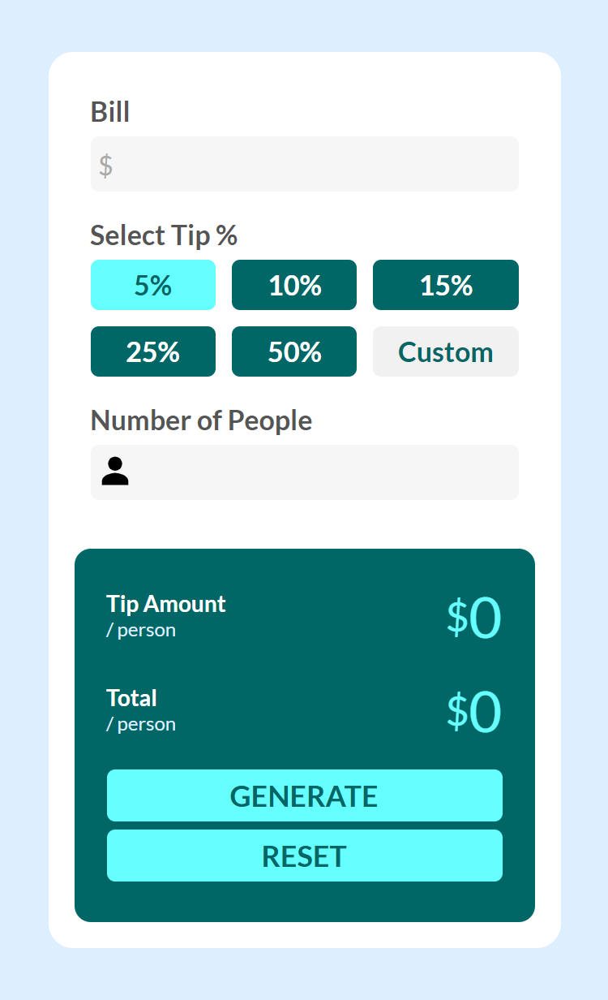
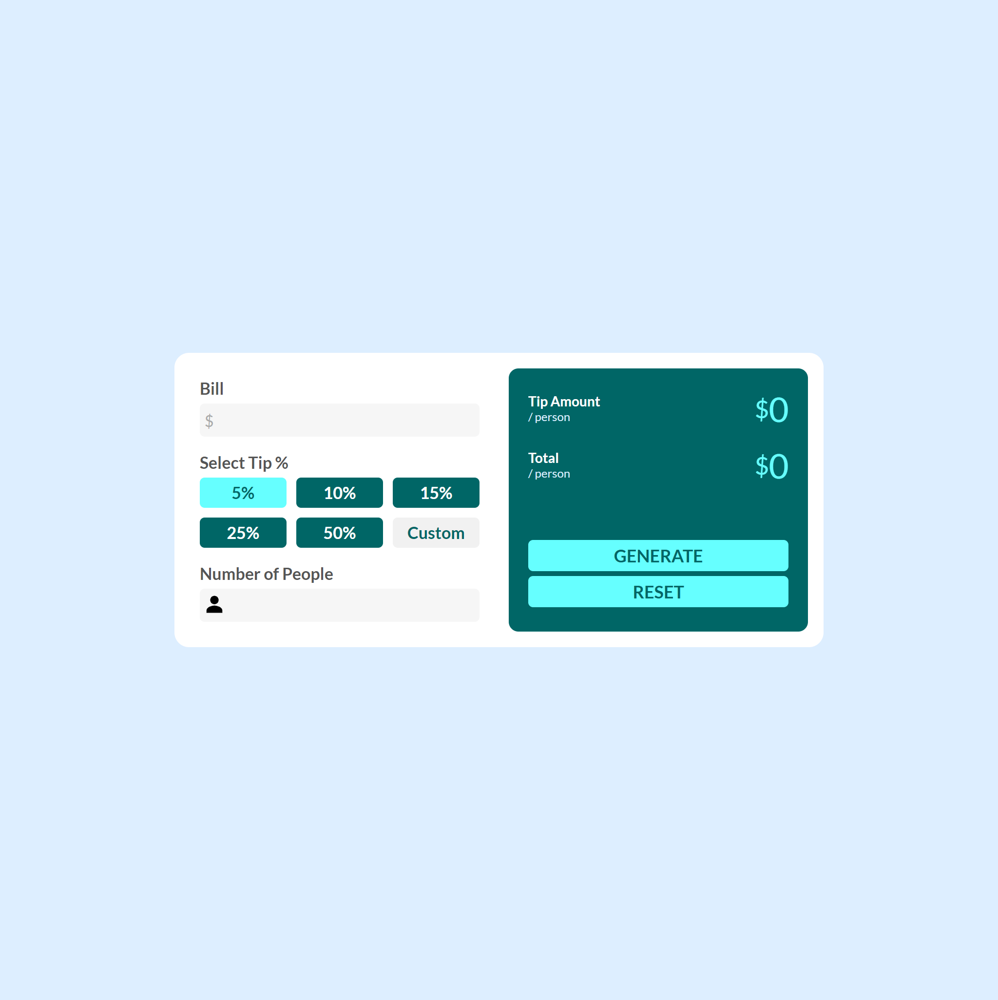

# Frontend Mentor - Bill Splitter

This is a solution to the [Bill Splitter challenge on Frontend Mentor](https://www.frontendmentor.io/challenges). Frontend Mentor challenges help you improve your coding skills by building realistic projects. 

## Table of contents

- [Overview](#overview)
  - [The challenge](#the-challenge)
  - [Screenshot](#screenshot)
  - [Links](#links)
- [My process](#my-process)
  - [Built with](#built-with)

  
## Overview

This is a bill splitter application. Users can split the bills taking the number of people and the tip percentage into account.

### The challenge

Users should be able to:

- View the optimal layout for the site depending on their device's screen size
- See hover states for all interactive elements on the page
- Calculate the bills and tips 

### Screenshots

### Links

- Solution URL: [Code on Github](https://github.com/ikennaezef/bill-splitter)
- Live Site URL: (https://ikennaezef.github.io/bill-splitter/)

## My process

### Built with

- Semantic HTML5 markup
- CSS custom properties
- Flexbox
- CSS Grid
- Mobile-first workflow
- Vanilla JavaScript
